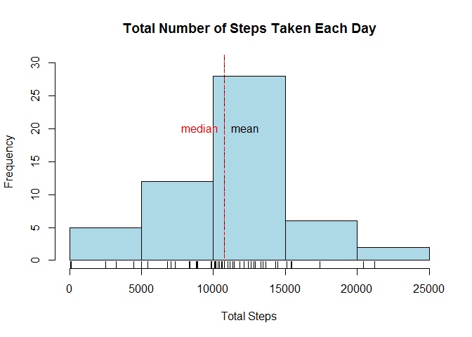
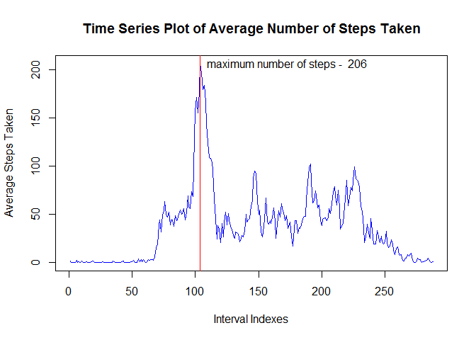
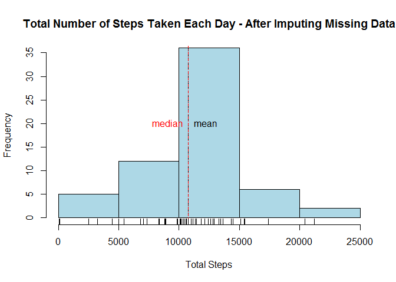
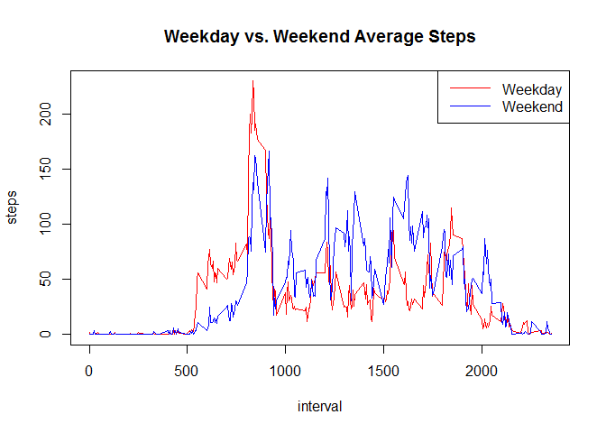

# Reproducible Research: Peer Assessment 1


## Loading and preprocessing the data

This project analyses data collected from a personal activity monitoring device.

The variables included in this dataset are:  
* steps: Number of steps taken in a 5-minute interval (missing values are coded as NA)  
* date: The date on which the measurement was taken in YYYY-MM-DD format.  
* interval: Identifer for the 5-minute interval in which the measurement was taken.  


Load the data.  Process/transform the data into a format suitable for the analysis.

Calculate the total steps taken per day.


```r
tbl <- read.csv("activity.csv")

library(reshape2)
library(dplyr)
tbl_m <- melt(tbl,id.vars=c("date"),measure.vars="steps",value.name="value",na.rm=TRUE)
tbl_summary <- tbl_m %>% group_by(date) %>% summarize(TotalSteps=sum(value))
head(tbl_summary)
```

```
## Source: local data frame [6 x 2]
## 
##         date TotalSteps
##       (fctr)      (int)
## 1 2012-10-02        126
## 2 2012-10-03      11352
## 3 2012-10-04      12116
## 4 2012-10-05      13294
## 5 2012-10-06      15420
## 6 2012-10-07      11015
```

## What is mean total number of steps taken per day?

Calculate and report the mean and median of the total number of steps taken per day.  The calculation shows they are almost the same.


```r
summary(tbl_summary$TotalSteps)
```

```
##    Min. 1st Qu.  Median    Mean 3rd Qu.    Max. 
##      41    8841   10760   10770   13290   21190
```

Make a histogram of the total number of steps taken each day.


```r
hist(tbl_summary$TotalSteps,main="Total Number of Steps Taken Each Day",
     xlab="Total Steps",col="light blue",ylim=c(0,30))
abline(v=mean(tbl_summary$TotalSteps),lty=2,col="black")
abline(v=median(tbl_summary$TotalSteps),lty=4,col="red")

text(mean(tbl_summary$TotalSteps),20,labels="mean",pos=4,col="black")
text(median(tbl_summary$TotalSteps),20,labels="median",pos=2,col="red")

rug(tbl_summary$TotalSteps,col="black")
```



## What is the average daily activity pattern?

Make a time series plot (i.e. type="l") of the 5-minute interval (x-axis) and the average number of steps taken, averaged across all days (y-axis).  Missing values are ignored for this.


```r
complete_cases <- subset(tbl,complete.cases(tbl) == TRUE)

interval_split <- split(complete_cases,complete_cases$interval,drop=TRUE)

average_steps <- sapply(interval_split,function(x) mean(x$steps))

plot(average_steps,type="l",main="Time Series Plot of Average Number of Steps Taken",
     xlab="Interval Indexes",ylab="Average Steps Taken",col="blue")

abline(v=which.max(average_steps),lty=1,col="red")

text(which.max(average_steps),max(average_steps),
     labels=paste("maximum number of steps - ",as.character(round(max(average_steps)))),
     pos=4,col="black")
```



## Imputing missing values

There are a number of days/intervals where there are missing values (coded as NA).  The presence of missing days may introduce bias into some calculations or summaries of the data.

Calculate and report the total number of missing values in the dateset.


```r
completeTF <- complete.cases(tbl)
numberMissing <- length(completeTF[completeTF == FALSE])
numberMissing
```

```
## [1] 2304
```
Devise a strategy for filling in the missing values.  Create a new dataset that is equal to the original dataset but with the missing data filled in. Make a histogram of the total number of steps taken each day and calculate and report the mean and median total number of steps taken per day.

I tried first with the impute function from the Hmisc library but found that the summarize function in Hmisc is different from the summarize function in dplyr, which is the one I wanted. The code will fill in the NAs with the mean for all days for an interval where there is a NA.  First it splits tbl into two data frames, one with the complete cases and one with the missing values.  Then it imputes the missing values, rebinds the two and orders them correctly.


```r
complete_cases <- subset(tbl,complete.cases(tbl) == TRUE)
interval_split <- split(complete_cases,complete_cases$interval,drop=TRUE)
average_steps <- sapply(interval_split,function(x) mean(x$steps))

completeTF <- complete.cases(tbl)
tbl2 <- cbind(tbl,completeTF)
tbl3 <- split(tbl2,tbl2$completeTF,drop=TRUE)

for (i in 1:nrow(tbl3[["FALSE"]])) {
 tbl3[["FALSE"]][i,1] <- round(subset(average_steps,
                                      names(average_steps)==as.character(tbl3[["FALSE"]][i,3])))
}

tbl4 <- rbind(tbl3[["FALSE"]],tbl3[["TRUE"]])
tbl4 <- tbl4[order(tbl4$date,tbl4$interval),]

tbl_m2 <- melt(tbl4,id.vars=c("date"),measure.vars="steps",value.name="value",na.rm=FALSE)

tbl_summary2 <- tbl_m2 %>% group_by(date) %>% summarize(TotalSteps=sum(value))

hist(tbl_summary2$TotalSteps,
     main="Total Number of Steps Taken Each Day - After Imputing Missing Data",
     xlab="Total Steps",col="light blue",ylim=c(0,35))

abline(v=mean(tbl_summary2$TotalSteps),lty=2,col="black")
abline(v=median(tbl_summary2$TotalSteps),lty=4,col="red")

text(mean(tbl_summary2$TotalSteps),20,labels="mean",pos=4,col="black")
text(median(tbl_summary2$TotalSteps),20,labels="median",pos=2,col="red")

rug(tbl_summary2$TotalSteps,col="black")
```



What is the impact of imputing missing data on the extimates of the total daily number of steps?  The quartiles are different but the mean and median are the same.


```r
summary(tbl_summary2$TotalSteps)
```

```
##    Min. 1st Qu.  Median    Mean 3rd Qu.    Max. 
##      41    9819   10760   10770   12810   21190
```

## Are there differences in activity patterns between weekdays and weekends?

Create a new factor variable in the dataset with two levels - "weekday" and "weekend" indicating whether a given date is a weekday or a weekend day.  Make a panel plot containing a time series plot (i.e. type="l") of the 5-minute interval (x-axis) and the average number of steps taken, averaged across all weekdays or weekend days (y-axis).


```r
tbl4$date <- as.Date(strptime(tbl4$date, format="%Y-%m-%d"))
tbl4$dayType <- weekdays(tbl4$date)
for (i in 1:nrow(tbl)) {
        if (tbl4[i,]$dayType %in% c("Saturday","Sunday")) {
                tbl4[i,]$dayType <- "Weekend"
        } else {
                tbl4[i,]$dayType <- "Weekday"
        }
}
dayTypeSteps <- aggregate(tbl4$steps ~ tbl4$interval + tbl4$dayType, tbl4, mean)
## remove "tbl$" prefixes from column names of dayTypeSteps
names(dayTypeSteps) <- c("interval","dayType","steps")
par(mfrow=c(1,1))  
with(dayTypeSteps, plot(steps ~ interval, type="n", main="Weekday vs. Weekend Average Steps"))  
with(dayTypeSteps[dayTypeSteps$dayType == "Weekday",], lines(steps ~ interval, type="l", col="red"))  
with(dayTypeSteps[dayTypeSteps$dayType == "Weekend",], lines(steps ~ interval, type="l", col="blue" ))  
legend("topright", lty=c(1,1), col = c("red", "blue"), legend = c("Weekday", "Weekend"), seg.len=3)
```


